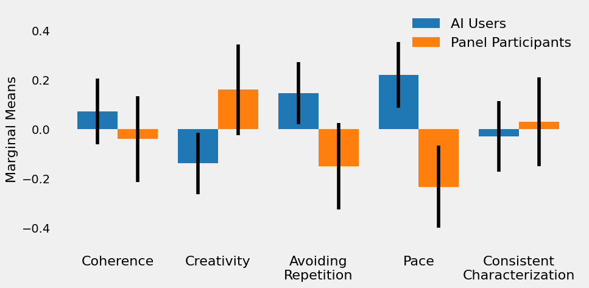

- [Study 1: Building the AI Story Scale](#study-1-building-the-ai-story-scale)
  - [Method](#method)
    - [Participants](#participants)
    - [Item Generation](#item-generation)
    - [Procedure And Materials](#procedure-and-materials)
      - [Story Excerpts](#story-excerpts)
        - [Prompt/Memory Pairs](#promptmemory-pairs)
        - [Generation Settings (Presets)](#generation-settings-presets)
      - [Quality-Control Questions](#quality-control-questions)
  - [Results](#results)
    - [Scale Construction](#scale-construction)
      - [Preliminary Analysis](#preliminary-analysis)
      - [Exploratory Factor Analysis](#exploratory-factor-analysis)
        - [Number Of Factors](#number-of-factors)
        - [Initial Factor Solution](#initial-factor-solution)
        - [Refinement of Factor Solution](#refinement-of-factor-solution)
    - [AISS Application Examples](#aiss-application-examples)
      - [Effect Of Generation Settings](#effect-of-generation-settings)
      - [Effect Of Prompts](#effect-of-prompts)
      - [AI Users Versus Panel (Student) Sample](#ai-users-versus-panel-student-sample)
      - [Do Readability Scores Predict Subjective Story Quality?](#do-readability-scores-predict-subjective-story-quality)
  - [Conclusion](#conclusion)

# Study 1: Building the AI Story Scale
This is the initial study for drafting the items for the AISS, and exploring their factorial structure. Based on the results of this study, I constructed the version of the AISS.

This study also contains a few proof-of-concept analyzes to show how the AISS can be used to gain a more detailed understanding of how different generation settings can lead to different types of stories.

## Method
### Participants
For this study, 398 participants were recruited from two sources: I gathered participants from the community of users of AI storytelling apps as well as from panels for academic research.

* Community: Recruited from community platforms of users of AI storytelling apps. Recruitment was carried out on the [NovelAI Discord](https://discord.com/invite/novelai), [NovelAI Reddit](https://discord.com/invite/novelai) and the [AI Multiverse Discord](https://discord.com/invite/puRyrw869h). (165 participants)
* Panels: Recruited from panels for academic research ([SurveySwap.io](https://surveyswap.io/) and [SurveyCircle.com](https://www.surveycircle.com/)). (233 participants)

The survey for participant panels did contain two additional quality-control items to sort out respondents with low data quality. This led to excluding 72 participants. Furthermore, three participants did not provide answers for all items and were also excluded. This left 323 participants for the analysis (162 from the community sample, 161 from the panels sample).

### Item Generation
To draft the questions for the AISS, I took stock of existing scales for evaluating different aspects of stories. Existing research that I deemed relevant for evaluating subjective story experiences included are summarized in the following table:

| Authors (Year) | Title | Measured Factors (# Items) | Psychometric Validation? | Notes |
|-|-|-|-|-|
| [Bussele & Bilandzic</br>(2009)](http://hypermedia468.pbworks.com/w/file/fetch/80687372/measuring%20narrative%20engagement.pdf) | Measuring Narrative Engagement | Narrative Engagement (4 Subscales):</br>- Narrative Understanding<br>- Attentional Focus<br>- Narrative Presence<br>- Emptional Engagement</br>(3 per subscale) | Yes<br>(EFA & CFA study) | Scale was originally intended for measuring narrative engagement with movies, and has not been used in research on GLMs.</br>Most measured factors were deemed to high-level for the purpose of judging current stories from GLMs.</br>Only (modified) items for narrative understanding were considered relevant for the AISS. |
| [Purdy, Wang, He, & Riedl</br>(2018)](https://faculty.cc.gatech.edu/~riedl/pubs/purdy-aiide18.pdf) | Predicting Generated Story Quality with Quantitative Measures | - Grammaticality</br>- Temporal Ordering</br>- Local Contextuality</br>- Repetition</br>- Interesting Language</br>- Enjoyment</br>- Quality</br>(1 item each) | No | |
| [Tambwekar et al.</br>(2019)](https://arxiv.org/pdf/1809.10736.pdf) | Controllable Neural Story Plot Generation via Reward Shaping  | - Single Plot</br>- Sopa Opera</br>(1 item each) | No | </br>The question on resemblance to a soap opera was specific to the tested model, and not used for this study.</br>Also contained the 7 items from [Purdy et al., 2018](https://www.cc.gatech.edu/~riedl/pubs/purdy-aiide18.pdf) |
| [DeLucia, Mueller & Li</br>(2021)](https://arxiv.org/pdf/2010.07375.pdf) | Decoding Methods for Neural Narrative Generation | - Interestingness</br>- Fluency</br>- Coherence</br>- Relevance</br>(1 item each) | No | Original items were [double-barreled](https://en.wikipedia.org/wiki/Double-barreled_question) (or even multiple-barreled) and deemed unnecessarily complex for participants.</br>However, descriptions provided for the factors were quite detailed and were used as inspiration for item generation.</br>Relevance regards the study of the prompt -> output relationship, which is not the current focus of the AISS and was therefore not considered further. |

_Notes: EFA = exploratory factor analysis, CFA = confirmatory factor analysis._

I then categorized these existing items into different hypothesized story aspects. These story aspects were coherence, creativity, general story quality, repetitiveness and writing style.

Furthermore, I interviewed various users of AI storytelling apps to gather feedback on what aspects of AI-generated stories they deem important. Based on these interviews, I reviewed the existing list of items gathered from existing research and decided to add two more tentative story aspects, namely consistent characterization and pace.

After establishing these 7 initial story aspects, I inspected the number of items per story aspect. In accordance with common guidelines for scale construction, I aimed for 8-12 provisional items per factor, anticipating that I would discard roughly half of my drafted items ([Hinkins et al., 1998](https://journals.sagepub.com/doi/abs/10.1177/109442819800100106)). Therefore, I drafted additional items as needed to create a solid base for later scale construction. This led to a total of 73 provisional items for the first draft of the AISS.

All items were to be answered on a 5-point Likert scale, ranging from 1 (strongly disagree) to 5 (strongly agree).

> For the following questions, please think of the story you just read.
> 
> Read each of the following statements and decide how much you agree with each.

The full list of tentative items, their source, and its final status regarding the AISS can be viewed when clicking the line below.

<details>
<summary>Click here to view the table with all provisional items.</summary>

| Item                                                                             | Retained For AISS-v1? | AISS Story Aspect           | Reason For Elimination                                | Hypothesized Story Aspect   | Source<sup>a                                                                                                                  |
| -------------------------------------------------------------------------------- | --------------------- | --------------------------- | ----------------------------------------------------- | --------------------------- | ----------------------------------------------------------------------------------------------------------------------------- |
| This story avoided repetition.                                                   | ✔                     | Avoiding Repetition         |                                                       | Repetitiveness              | [Purdy et al. (2018)](https://www.cc.gatech.edu/~riedl/pubs/purdy-aiide18.pdf)                                              |
| Many sentences in the story had frequently repeated words and phrases.           | ✔                     | Avoiding Repetition         |                                                       | Repetitiveness              | Inspired by [DeLucia, Mueller & Li (2021)](https://arxiv.org/pdf/2010.07375.pdf)                                            |
| Characters repeated what other characters had said to them.                      | ✔                     | Avoiding Repetition         |                                                       | Repetitiveness              | Own                                                                                                                           |
| One character did something he or she had already done previously in this story. | ✔                     | Avoiding Repetition         |                                                       | Repetitiveness              | Own                                                                                                                           |
| Characters said or did the same thing many times over.                           | ✔                     | Avoiding Repetition         |                                                       | Repetitiveness              | Own                                                                                                                           |
| Characters repeated their actions with little variation.                         | ✔                     | Avoiding Repetition         |                                                       | Repetitiveness              | Own                                                                                                                           |
| I had a hard time recognizing the thread of the story.                           | ✔                     | Coherence                   |                                                       | Coherence                   | [Bussele & Bilandzic (2009)](http://hypermedia468.pbworks.com/w/file/fetch/80687372/measuring%20narrative%20engagement.pdf) |
| This story’s events occurred in a plausible order.                               | ✔                     | Coherence                   |                                                       | Coherence                   | [Purdy et al. (2018)](https://www.cc.gatech.edu/~riedl/pubs/purdy-aiide18.pdf)                                              |
| The story appeared to be a single plot.                                          | ✔                     | Coherence                   |                                                       | Coherence                   | [Tambwekar et al. (2019)](https://arxiv.org/pdf/1809.10736.pdf)                                                             |
| The story had a clear theme.                                                     | ✔                     | Coherence                   |                                                       | Coherence                   | Own                                                                                                                           |
| The plot of the story was plausible.                                             | ✔                     | Coherence                   |                                                       | Coherence                   | Own                                                                                                                           |
| The story felt like a coherent story.                                            | ✔                     | Coherence                   |                                                       | Coherence                   | Own                                                                                                                           |
| All elements of the story were relevant to the plot.                             | ✔                     | Coherence                   |                                                       | Pace                        | Own                                                                                                                           |
| Characters in the story were described in a contradicting manner.             | ✔                     | Consistent Characterization | | Consistent Characterization                           | Own                         |
| The way the characters were described was inconsistent.                          | ✔                     | Consistent Characterization | | Consistent Characterization                           | Own                         |
| The story was innovative.                                                        | ✔                     | Creativity/Quality          |                                                       | Creativity                  | Own                                                                                                                           |
| The setting of the story was original.                                           | ✔                     | Creativity/Quality          |                                                       | Creativity                  | Own                                                                                                                           |
| This story was of high quality.                                                  | ✔                     | Creativity/Quality          |                                                       | General Quality             | [Purdy et al. (2018)](https://www.cc.gatech.edu/~riedl/pubs/purdy-aiide18.pdf)                                              |
| I would like to read more stories like this one.                                 | ✔                     | Creativity/Quality          |                                                       | General Quality             | Own                                                                                                                           |
| The story moved at a fast pace.                                                  | ✔                     | Pace                        |                                                       | Pace                        | Own                                                                                                                           |
| It took a long time for things to happen in the story.                           | ✔                     | Pace                        |                                                       | Pace                        | Own                                                                                                                           |
| Nothing seemed to be happening in the story.                                     | ✔                     | Pace                        |                                                       | Pace                        | Own                                                                                                                           |
| The plot had no development.                                                     | ✔                     | Pace                        |                                                       | Repetitiveness              | Own                                                                                                                           |
| I had a hard time making sense of what was going on in the story.                | ✖                     |                             | Multicollinearity / Redundancy                        | Coherence                   | [Bussele & Bilandzic (2009)](http://hypermedia468.pbworks.com/w/file/fetch/80687372/measuring%20narrative%20engagement.pdf) |
| The story felt like a series of disconnected sentences.                          | ✖                     |                             | High cross-loadings                                   | Coherence                   | Own                                                                                                                           |
| The story stayed on topic with a consistent plot.                                | ✖                     |                             | Multicollinearity / Redundancy                        | Coherence                   | Own                                                                                                                           |
| The story felt like it contained a bunch of jumbled topics.                      | ✖                     |                             | Multicollinearity / Redundancy                        | Coherence                   | Own                                                                                                                           |
| The story had a clearly identifiable plot.                                       | ✖                     |                             | Multicollinearity / Redundancy                        | Coherence                   | Own                                                                                                                           |
| The story lacked logic.                                                          | ✖                     |                             | Multicollinearity / Redundancy                        | Coherence                   | Own                                                                                                                           |
| It was easy to understand the motivation of the characters in the story.         | ✖                     |                             | High cross-loadings                                   | Consistent Characterization | Own                                                                                                                           |
| How characters in the story acted seemed implausible.                            | ✖                     |                             | Low main loading                                      | Consistent Characterization | Own                                                                                                                           |
| Descriptions of characters in the story were consistent.                         | ✖                     |                             | Multicollinearity / Redundancy                        | Consistent Characterization | Own                                                                                                                           |
| The behavior of characters in the story seemed completely random.                | ✖                     |                             | Multicollinearity / Redundancy                        | Consistent Characterization | Own                                                                                                                           |
| My understanding of the characters in the story is unclear.                      | ✖                     |                             | Multicollinearity / Redundancy                        | Consistent Characterization | Own                                                                                                                           |
| The descriptions of characters in the story were plausible.                      | ✖                     |                             | Multicollinearity / Redundancy                        | Consistent Characterization | Own                                                                                                                           |
| The story was boring.                                                            | ✖                     |                             | Multicollinearity / Redundancy                        | Creativity                  | [Inspired by DeLucia, Mueller & Li (2021)](https://arxiv.org/pdf/2010.07375.pdf)                                            |
| The story felt dynamic.                                                          | ✖                     |                             | High cross-loadings                                   | Creativity                  | Inspired by [DeLucia, Mueller & Li (2021)](https://arxiv.org/pdf/2010.07375.pdf)                                            |
| The plot development in the story was predictable.                               | ✖                     |                             | Detrimental to Omega Hierachical (Coherence)          | Creativity                  | Own                                                                                                                           |
| There were interesting twists and turns in the story.                            | ✖                     |                             | High cross-loadings                                   | Creativity                  | Own                                                                                                                           |
| It was surprising how things turned out in the story.                            | ✖                     |                             | Low main loading                                      | Creativity                  | Own                                                                                                                           |
| The story was creative.                                                          | ✖                     |                             | Multicollinearity / Redundancy                        | Creativity                  | Own                                                                                                                           |
| The story was imaginative.                                                       | ✖                     |                             | Multicollinearity / Redundancy                        | Creativity                  | Own                                                                                                                           |
| I was intrigued by the plot.                                                     | ✖                     |                             | Multicollinearity / Redundancy                        | Creativity                  | Own                                                                                                                           |
| The story was unconventional.                                                    | ✖                     |                             | Multicollinearity / Redundancy                        | Creativity                  | Own                                                                                                                           |
| The plot was typical for this kind of story.                                     | ✖                     |                             | Multicollinearity / Redundancy                        | Creativity                  | Own                                                                                                                           |
| The story was fun to read.                                                       | ✖                     |                             | Multicollinearity / Redundancy                        | General Quality             | Inspired by [DeLucia, Mueller & Li (2021)](https://arxiv.org/pdf/2010.07375.pdf)                                            |
| The story made me want to keep reading.                                          | ✖                     |                             | Multicollinearity / Redundancy                        | General Quality             | Inspired by [DeLucia, Mueller & Li (2021)](https://arxiv.org/pdf/2010.07375.pdf)                                            |
| The story felt vivid.                                                            | ✖                     |                             | Multicollinearity / Redundancy                        | General Quality             | Inspired by [DeLucia, Mueller & Li (2021)](https://arxiv.org/pdf/2010.07375.pdf)                                            |
| This story was enjoyable.                                                        | ✖                     |                             | Multicollinearity / Redundancy                        | General Quality             | [Purdy et al. (2018)](https://www.cc.gatech.edu/~riedl/pubs/purdy-aiide18.pdf)                                              |
| I liked this story.                                                              | ✖                     |                             | Multicollinearity / Redundancy                        | General Quality             | Own                                                                                                                           |
| The story was well-written.                                                      | ✖                     |                             | Multicollinearity / Redundancy                        | General Quality             | Own                                                                                                                           |
| The writing style was entertaining.                                              | ✖                     |                             | Multicollinearity / Redundancy                        | General Quality             | Own                                                                                                                           |
| Many things seemed to be happening at once in the story.                         | ✖                     |                             | Detrimental to Omega Hierachical (Coherence)          | Pace                        | Own                                                                                                                           |
| There was plenty of action in the story.                                         | ✖                     |                             | High cross-loadings                                   | Pace                        | Own                                                                                                                           |
| The story dragged on and on.                                                     | ✖                     |                             | High cross-loadings                                   | Pace                        | Own                                                                                                                           |
| There’s nothing superfluous or unnecessary in this story.                        | ✖                     |                             | Low main loading                                      | Pace                        | Own                                                                                                                           |
| The story was exciting to read.                                                  | ✖                     |                             | Multicollinearity / Redundancy                        | Pace                        | Own                                                                                                                           |
| The story was very repetitive.                                                   | ✖                     |                             | Multicollinearity / Redundancy                        | Repetitiveness              | Own                                                                                                                           |
| In the story, the same things happened again and again.                          | ✖                     |                             | Multicollinearity / Redundancy                        | Repetitiveness              | Own                                                                                                                           |
| The writing seemed to use the same words over and over.                          | ✖                     |                             | Multicollinearity / Redundancy                        | Repetitiveness              | Own                                                                                                                           |
| Particular words were used too often in the story.                               | ✖                     |                             | Multicollinearity / Redundancy                        | Repetitiveness              | Own                                                                                                                           |
| There were similar events that occurred repeatedly in the story.                 | ✖                     |                             | Multicollinearity / Redundancy                        | Repetitiveness              | Own                                                                                                                           |
| This story used interesting language.                                            | ✖                     |                             | Multicollinearity / Redundancy                        | Writing Style               | [Purdy et al. (2018)](https://www.cc.gatech.edu/~riedl/pubs/purdy-aiide18.pdf)                                              |
| The story had sentences that were unreadable.                                    | ✖                     |                             | Low main loading                                      | Writing Style               | Inspired by [DeLucia, Mueller & Li (2021)](https://arxiv.org/pdf/2010.07375.pdf)                                            |
| The story used complex vocabulary.                                               | ✖                     |                             | Detrimental to Omega Hierachical (Creativity/Quality) | Writing Style               | Own                                                                                                                           |
| The story contained a great deal of detail.                                      | ✖                     |                             | Detrimental to Omega Hierachical (Creativity/Quality) | Writing Style               | Own                                                                                                                           |
| The text was easy to understand.                                                 | ✖                     |                             | Low Communality                                       | Writing Style               | Own                                                                                                                           |
| The writing style was too complicated to be understood easily.                   | ✖                     |                             | Low main loading                                      | Writing Style               | Own                                                                                                                           |
| The text contained a broad vocabulary.                                           | ✖                     |                             | Multicollinearity / Redundancy                        | Writing Style               | Own                                                                                                                           |
| The wording of this text was very precise.                                       | ✖                     |                             | Multicollinearity / Redundancy                        | Writing Style               | Own                                                                                                                           |
| The story contained a great deal of detail.                                      | ✖                     |                             | Multicollinearity / Redundancy                        | Writing Style               | Own                                                                                                                           |
| The writing style of the story was very good.                                    | ✖                     |                             | Multicollinearity / Redundancy                        | Writing Style               | Own                                                                                                                           |
| The author’s choice of words was elegant.                                        | ✖                     |                             | Multicollinearity / Redundancy                        | Writing Style               | Own                                                                                                                           |
| The story had no obvious grammatical mistakes.                                   | ✖                     |                             | Multicollinearity / Redundancy                        | Writing Style               | Own                                                                                                                           |

_Notes: a = Some items were modified to be more consistent with the rest of the scale._

</details>

### Procedure And Materials
After signing an informed consent, participants first read a story excerpt generated by a generative pre-trained transformer (GPT) model. Each story excerpt had a reading time of roughly 5 minutes. For participants from the panel sample, the story excerpt was followed by the first quality-control question. Subsequently, participants evaluated the story excerpts on the 73 provisional items for the AISS. For the panel sample, a further quality-control question was mixed in the provisional AISS items.
#### Story Excerpts
320 Story excerpts were generated by using the [NovelAI Research Tool (`nrt`)](https://github.com/wbrown/novelai-research-tool). Through `nrt`, a short prompt and "memory" text (explained below) was sent to Euterpe, a finetune of the [Fairseq GPT-13B model](https://github.com/facebookresearch/fairseq/tree/main/examples/moe_lm) offered by [NovelAI](https://novelai.net/). The prompt and memory text served to establish the genre (High Fantasy, Hard Sci-Fi, Historical Romance or Horror). For each story excerpt, Euterpe ran through 30 generations using one NAI's predefined generation settings (called "presets" within NAI). A total of 8 default presets was used for story generation, and the max character length set to 40. The results were 320 story excerpts (40 per preset) with a word count of 744 to 1499 (_M_ = 1175.17, _SD_ = 117.12, about 5 minutes reading time).

##### Prompt/Memory Pairs
Story generation made use of a prompt and "memory" text. The prompt formed the base for the initial input to the model. In addition, the "memory" functionality of NAI was used. Memory in this context denotes a set of tokens that is always used to build the top of the context window. This is a way to ensure that the model always "remembers" a certain set of tokens essentially to the story generation. In this case, the memory function was used to ensure that the model always remembered the genre of the story. Stories in the NAI finetune corpus are known to be manually meta-tagged in the following manner

```
[Author: <Author Name>; Title: <Title>; Tags: <Tags>; Genre: <Genre>]
```

As an example, a hypothetical book from J.K. Rowling could be tagged as:

```
[ Author: J.K. Rowling; Title: The Raining Night; Tags: deserted tropical island, time travel; Genre: horror ]
```

As I was only interested in keeping the genre at least somewhat consistent for one specific memory/prompt pair, only the `Genre:` tag was used. The specific memory/prompt pairs used for the study are listed below:

| Label | Memory | Prompt |
|---|---|---|
| **Hard Sci-Fi** | \[ Author: ; Tags: ; Genre: Hard Sci-fi \] | "I have a message for you from the president," said Dr. Sato, handing over an envelope to me. "He's asking that we meet with him at his office this afternoon." I took it and thanked her before walking out of my apartment building into the bright sun. It was already noon on Mars—the longest day in the year here on the planet. |
| **High Fantasy** | \[ Author: ; Tags: ; Genre: High Fantasy \] | The sun was high in the sky when they arrived at their destination. The valley of the River Tethys flowed into a wide, shallow lake surrounded by mountains on all sides. A small village sat along its shores with two towers standing guard over it from either side like sentinels. It looked to be deserted but for some smoke rising up out of chimneys and the occasional bird flying overhead or flitting through trees. |
| **Historical Romance** | \[ Author: ; Tags: ; Genre: Historical Romance \] | The first time he saw her, the sight of her was like a slap across his face. She'd come into the tavern where he worked and sat at one of the tables in front of him. |
| **Horror** | \[ Author: ; Tags: ; Genre: Horror \] | I woke up to hear knocking on glass. At first, I thought it was the window until I heard it come from the mirror again. I got out of bed and walked over to the mirror. When I looked into it, there was a face looking back at me. |

##### Generation Settings (Presets)
NAI presets are a predefined batch of settings for the text generation. The reason for choosing the different generation settings offered by NAI was to ensure using sets of settings that had already been tested and found to be useful for story generation for a commercial product. The presets used for this study are listed below (using their names given by NAI):

| label | temperature | max_length | min_length | top_k | top_p | top_a | tail_free_sampling | repetition_penalty | repetition_penalty_range | repetition_penalty_slope | repetition_penalty_frequency | repetition_penalty_presence | order |
|---|---|---|---|---|---|---|---|---|---|---|---|---|---|
| Ace of Spades (14/02/2022) | 1.15 | 40 | 1 | 0 | 0.95 | 1 | 0.8 | 2.75 | 2048 | 7.02 | 0 | 0 | TFS, Top-p, Top-k, Temperature |
| All-Nighter (14/02/2022) | 1.33 | 40 | 1 | 13 | 1 | 1 | 0.836 | 2.366 | 400 | 0.33 | 0.01 | 0 | TFS, Top-p, Top-k, Temperature |
| Basic Coherence (14/02/2022) | 0.585 | 40 | 1 | 0 | 1 | 1 | 0.87 | 3.05 | 2048 | 0.33 | 0 | 0 | Temperature, Top-k, Top-p, TFS |
| Fandango (14/02/2022) | 0.86 | 40 | 1 | 20 | 0.95 | 1 | 1 | 2.25 | 2048 | 0.09 | 0 | 0 | Top-p, Top-k, TFS, Temperature |
| Genesis (14/02/2022) |  0.63 | 40 | 1 | 0 | 0.975 | 1 | 0.975 | 2.975 | 2048 | 0.09 | 0 | 0 | Top-p, Top-k, TFS, Temperature |
| Low Rider (14/02/2022) |  0.94 | 40 | 1 | 12 | 1 | 1 | 0.94 | 2.66 | 2048 | 0.18 | 0.013 | 0 | Top-p, Top-k, TFS, Temperature |
| Morpho (14/02/2022) | 0.6889 | 40 | 1 | 0 | 1 | 1 | 1 | 1 | 2048 | 0 | 0.1 | 0 | Temperature, Top-k, Top-p, TFS |
| Ouroboros (14/02/2022) | 1.07 | 40 | 1 | 264 | 1 | 1 | 0.925 | 2.165 | 404 | 0.84 | 0 | 0 | Top-k, Temperature, TFS, Top-p |

Documentation for the NAI API, including valid value ranges for the generation settings, can be found [here](https://api.novelai.net/docs/).

#### Quality-Control Questions
To ensure that participants from the panel sample were providing valid responses, two quality-control questions were included in the survey.

The first question immediatly followed the story excerpt and asked the participant how the story they just read began. The participant was asked to select one of six options. If the chosen option coincided with the content of the story, the first quality check was passed.

> The story I just read, began with...
> *   ...with a message from the president.
> *   ...the description of a small village.
> *   ...a noise coming from a mirror.
> *   ...someone working in a tavern.
> *   ...two armies clashing in a battle.
> *   ...someone waking up in a spaceship.

The second question was mixed in with the provisional AISS items and simply stated:

> This is a quality check. Please select "Somewhat disagree".

To pass this quality check, the participant had to select "Somewhat disagree" for this item.

## Results
### Scale Construction
#### Preliminary Analysis
Initial inspection of the intercorrelations between the items showed a sufficient number of correlations above the recommended threshold of |_r_| > .3 ([Tabachnik, Fidell, 2018](https://www.pearson.com/en-us/subject-catalog/p/using-multivariate-statistics/P200000003097?view=educator)). However, the determinant was far below the recommend threshold of _det_ > .00001, indicating strong multicollinearity and the presence of redundant items. To address this issue, I removed the item with the highest variance inflation factor (VIF) in an iterative process, until the determinant was above .00001. This resulted in the exclusion of 42 questions with 31 remaining items, _det_ = 00002.
The appropriateness of exploratory factor analysis (EFA) for this data was assessed using the Kaiser-Meyer-Olkin (KMO) measure of sampling adequacy. The KMO indicated that the data was well-suited for EFA, _KMO_ = .86.
#### Exploratory Factor Analysis
##### Number Of Factors
The decision on the number of factors to retain was based on a parallel analysis ([Horn, 1965](http://dx.doi.org/10.1007/BF02289447); [Glorfeld, 1995](http://dx.doi.org/10.1177/0013164495055003002)) as well as an inspection of the scree plot. I therefore decided to obtain a four- as well as a five-factor solution, and to compare the stability and interpretability of the factors across the two solutions.

Both the four- and five-factor solutions resulted in interpretable factors. Ultimately, I chose the five-factor solution for further analysis, because it had the maximum number of factors that had good support from the scree-plot and parallel analysis. This solution will be described in more detail below.

##### Initial Factor Solution
To obtain the initial five-factor solution, I used the minimum residual (MINRES) algorithm with direct oblimin rotation. I used an iterative process to obtain the solution, excluding items that showed low communality or that did not conform well to a simple structure. The criteria for retaining items were:
*  _Communality_ > .2
*  _Main Loading_ > .4
*  _Cross Loading_ < .3
*  _Main Loading_ - _Cross Loading_ > .2
Items that did not meet these criteria were excluded from the analysis, and the EFA was rerun until all remaining items met the criteria. This led to the exclusion of 9 items, with 22 remaining items.

The resulting factors were interpreted according to the 1-2 items that loaded most strongly on them. The interpretation of factors, their number of items and internal reliability are listed below:

| Factor # | Interpretation | Number of Items | Omega Total | Omega Hierarchical |
|---|---|---|---|---|
| 1 | Creativity & Quality | 6 | .85 | -ᵃ |
| 2 | Coherence | 6 | .81 | .63 |
| 3 | Repetitiveness | 4 | .77 | .32 |
| 4 | Slow Pace | 4 | .75 | -ᵃ |
| 5 | Inconsistent Characterizations | 2 | -ᵇ | -ᵇ |

ᵃ: Heywood case for common factor. Omega Hierachical could not be reliably estimated.\
ᵇ: Only 2 items. Omega could not be computed. Spearman-Brown reliability coefficient was 0.76.

##### Refinement of Factor Solution
While the initial factor solution was interpretable, it was not optimal. Factor 5 consisted only of 2 items, which might be too low for a reliable measurement of the factor. Furthermore estimation of the common factor lead to a Heywood case for two factors, indicating that a single factor model was not appropriate. For the remaining factors, estimates of omega hierarchical were not satisfactory. Therefore, I undertook several steps to improve the factor solution.

Omega hierarchical for repetitiveness could be improved by removing a problematic item ("Characters repeated what other characters had said to them."), leading to reliability estimates of omega total = .77 and omega hierachical = .62.

Furthermore, I inspected the structure of the group factors for the remaining problematic factors. The creativity/quality factor seemed to be made up of three subfactors: creativity, quality and writing complexity. The coherence factor seemed to be made up of potentially up to four subfactors: narrative unity (one single theme/plot/etc), relevance, narrative focus (limited number of things happening at once) and predictability. Slow Pace seemed to be made up of two sub-scales, but those were not immediatly interpretable.

Overall, it appeared that the factors might benefit from additinal items to better capture the underlying constructs. The initial exclusion of items for multicollinearity might have been too strict as it might have led to the exclusion of items that were important for the factor structure. With more clearly defined factors, I therefore decided to tentatively add back a selected set of items that seemed to complement the obtained factors. After those items were added back, I reran the full EFA, including prelimary checks for multicollinearity and the removal of items that did not meet the criteria for retention.

This led to a final factor solution with 26 items. The rotated loadings for the final factor solution are shown below:

| Item # | Description | Factor 1 | Factor 2 | Factor 3 | Factor 4 | Factor 5 |
|---|---|---|---|---|---|---|
| 1 | The plot of the story was plausible. | **.62** | -.04 | .12 | .12 | -.03 |
| 2 | I had a hard time recognizing the thread of the story. | **-.66** | .03 | .08 | .18 | .15 |
| 3 | The story had a clear theme. | **.65** | -.02 | .04 | -.12 | .02 |
| 4 | The plot development in the story was predictable. | **.63** | .01 | -.10 | .18 | .12 |
| 5 | The story appeared to be a single plot. | **.60** | .06 | -.05 | .06 | -.02 |
| 6 | The story felt like a coherent story. | **.55** | -.02 | .24 | .10 | -.20 |
| 7 | All elements of the story were relevant to the plot. | **.51** | .11 | .20 | -.23 | -.07 |
| 8 | Many things seemed to be happening at once in the story. | **-.46** | .06 | .16 | -.11 | .16 |
| 9 | This story’s events occurred in a plausible order. | **.45** | -.10 | .08 | .03 | -.24 |
| 10 | Characters said or did the same thing many times over. | .06 | **.82** | .06 | .02 | .04 |
| 11 | One character did something he or she had already done previously in this story. | .05 | **.77** | .00 | -.06 | -.02 |
| 12 | Characters repeated their actions with little variation. | .06 | **.75** | .04 | .11 | -.02 |
| 13 | Many sentences in the story had frequently repeated words and phrases. | -.03 | **.70** | .00 | -.05 | .00 |
| 14 | This story avoided repetition. | .04 | **-.68** | .19 | -.02 | .01 |
| 15 | The story was innovative. | -.21 | .03 | **.64** | -.14 | -.10 |
| 16 | This story is of high quality. | .19 | -.13 | **.62** | .04 | -.09 |
| 17 | I would like to read more stories like this one. | .28 | -.09 | **.58** | -.04 | .07 |
| 18 | The story used complex vocabulary. | -.04 | .05 | **.53** | .05 | .02 |
| 19 | The setting of the story was original. | -.10 | -.03 | **.52** | .05 | .02 |
| 20 | The story contained a great deal of detail. | .05 | .01 | **.48** | .09 | .04 |
| 21 | It took a long time for things to happen in the story. | .04 | .04 | .17 | **.70** | .01 |
| 22 | Nothing seemed to be happening in the story. | -.05 | .04 | -.16 | **.62** | .00 |
| 23 | The story moved at a fast pace. | -.16 | -.03 | .07 | **-.54** | .13 |
| 24 | The plot had no development. | -.24 | .07 | -.14 | **.49** | .05 |
| 25 | The way the characters were described was inconsistent. | -.02 | .02 | .02 | -.02 | **.79** |
| 26 | Characters in the story were described in a contradicting manner. | .02 | .00 | .02 | -.02 | **.77** |

Similar to the factors obtained in the initial five-factor solution, I interpreted factor 1 to represent a story's perceived coherence, factor 2 repetetiveness, factor 3 a story's creativity and quality, factor 4 slow pace, and factor 5 inconstent characterizations. 

Further inspection of the factors revealed a few items whose removal improved the reliability of the factors.

For the coherence factor, removal of item 4 ("The plot development in the story was predictable.") and 8 ("Many things seemed to be happening at once in the story.") improved the reliability of the factor.

For the creativity/quality factor, I removed item 18 ("The story used complex vocabulary.") and 20 ("The story contained a great deal of detail.") to improve the reliability of the factor.

As a last step, the direction of some factors were reversed so that all factors reflect a positive direction. The interpretation of the final factors, their number of items and internal reliability are listed below:

| Factor # | Interpretation | Number of Items | Omega Total | Omega Hierarchical |
|---|---|---|---|---|
| 1 | Coherence | 7 | .87 | .77 |
| 2 | Avoid Repetitiveness | 5 | .87 | .85 |
| 3 | Creativity & Quality | 4 | .81 | .67 |
| 4 | Pace | 4 | .75 | -ᵃ |
| 5 | consistent Characterizations | 2 | -ᵇ | -ᵇ |

ᵃ: Heywood case for common factor. Omega Hierachical could not be reliably estimated.
ᵇ: Only 2 items. Omega could not be computed. Spearman-Brown reliability coefficient was 0.76.

While this scale still has plenty of avenues for further exploration and optimization, it should already provide a good instrument to use in future studies. The final AISS v1 with all 23 items can be found [here](../AISS/v1/aiss_v1.md).

### AISS Application Examples
To demonstrate how the AISS could be used to aid future research, I carried out a few proof of concept analyses. In this case I used the factor scores obtained in the final factor solution to explore the role of generation settings on the nature of the resulting story excerpts. Of course, this idea could be further extended to study the influence of different model architectures, training data, hyperparameters, etc. on the nature of the generated stories. While this analysis employs factor scores for greater precision, it would also possible to use the scale means to explore such effects.

All analyses reported in here were carried out with a significance level of .05.

To explore the effect of generation settings and prompt on the nature of the generated story excerpts, I conducted one seperate ANOVA for each AISS factor with the respective factor score as dependent variable and generation settings, prompt and sample source as predictors. Since clear heteroscedasticity was present in the data, I used the [HC3 standard errors](https://doi.org/10.2307/2685594) to correct for this. To test for effects of the predictors, I set up the following planned contrasts:
* Generation settings: [Sum (Deviation) coding (compares each level to the grand mean)](https://www.statsmodels.org/dev/examples/notebooks/generated/contrasts.html#Sum-(Deviation)-Coding)
* Prompts: Sum Coding
* Sample Source: [Dummy (Treatment) Coding, with the community sample as the reference group](https://www.statsmodels.org/dev/examples/notebooks/generated/contrasts.html#Treatment-(Dummy)-Coding)

For the contrasts, p-values were corrected for multiple testing using the [Benjamini/Hochberg correction for false discovery rate](https://www.statsmodels.org/dev/generated/statsmodels.stats.multitest.fdrcorrection.html). All reported regression coefficients are standardized.

The ANOVA served to find reliable effects of the predictors on the mean of the factor scores. However, there were good reasons to suspect effects on the _variance_ of the factor scores as well, especially for the generation settings. More specificaly, the tested presets apply a variety of different generation settings like [temperature](https://medium.com/@imisri1/how-to-set-sampling-temperature-for-gpt-models-762887df1fac), samling ([top-k](https://huggingface.co/blog/how-to-generate#top-k-sampling), [top-p](https://huggingface.co/blog/how-to-generate#top-p-nucleus-sampling), [tfs](https://www.trentonbricken.com/Tail-Free-Sampling/), etc), repetition penalty, etc. Together, these settings might do two things:
* Cut out bad tokens – this should increase the average scores on story aspects. These average scores over several outputs were analyzed in the ANOVAs.
* Change the distribution of token probabilities. This could either sharpen the curve, making likely tokens even more likely. Or it could flatten the curve, making likely tokens less prominent and strengthen somewhat unlikely tokens. The former would lead to fairly consistent outputs, while the latter would make outputs more varied. In other words, presets might differ in their _variance_ of story aspect scores. Two presets might thus differ in how _consistent_ their outputs are, even if they have the same _average_.

To explore this idea, I employed Levene's test for homogeneity of variance. For both presets and prompt, I conducted one Leven's test for each factor as an omnibus test. In the case of a significant result I followed up with a post-hoc test, comparing each category to the mean of all other categories combined. P-values for the post-hoc tests were also corrected for multiple testing using the [Benjamini/Hochberg correction for false discovery rate](https://www.statsmodels.org/dev/generated/statsmodels.stats.multitest.fdrcorrection.html).

In here, I will only present noteworthy results. For the full results, please refer to the [Story Analysis Notebook](/study1_scale_construction/step_3_story_analyses.ipynb).

#### Effect Of Generation Settings
The result for the average perfomance of the presets on the AISS factors are shown in the following graph. (Error bars represent the 95% confidence intervals for the mean. Scores are regression effects, correcting for the influence of the prompt and assuming the community sample):


Genesis showed lower coherence ratings than the other presets, β = -.33, _p_ = .046, 95% _CI_ = [-.53, -.13].

If I am being honest, it is not immediatly obvious to me what is causing this effect. [Genesis' set of settings](#generation-settings-presets) could be described as very light sampling with Nucleus and TFS (.975 for both) combined with low temperature (.63) and high repitition penalty (2.975). _Something_ in that combination does not seem to work as intended, but for now it is unclear what exactly.

All-Nighter showed generally average ratings for all story factors, |β<i>s</i>| < .19, _ps_ > .55. However, it also showed a high _variance_ when it came to coherence, _p_ = .001, _SD<sub>All-Nighter</sub>_ = 1.28, _SD<sub>all</sub>_ = 1.00.

It seems fairly obvious, that the cause of this effect is All-Nighter's high temperature. [All-Nighter's setting](#generation-settings-presets) are essentially strong sampling with TFS (0.836) combined with high randomness (1.33). Dialing up randomness does not seem to hurt average coherence much, but it does increase the spread around this average.

This effect is also visible in the following graph, which compares the overall distribution of coherence scores with All-Nighter:


Morpho was the only tested preset [without any sampling or repition penalty at all](#generation-settings-presets). The lack of repitition penalty becomes immediatly obvious in much lower ratings on "avoiding repetitiveness" for this preset, β = -.89, _p_ < .001, 95% _CI_ = [-1.11, -.66]. Furthermore, Morpho also showed lower rating for pace, β = -.46, _p_ = .002, 95% _CI_ = [-.67, -.25]. Interstingly, analysing the differences in variance between presets showed that Morpho also had a lower variance in pace, _p_ = .045, _SD<sub>Morpho</sub>_ = .78, _SD<sub>all</sub>_ = 1.00.

The reasons for these ratings become quickly apperent, when one looks at [example outputs](excerpts/morpho.md). The story visible degrades the longer it continues with this preset. Of course, stories that get caught up in long loops of repition do also not move forward so the low pace ratings are not suprising. Morpho also has relatively low temperature (.6889), which should lead to less varied token distributions. Indeed, this preset seems to not only archive low pace, but archive it _consistently_.

Note that despite having a similar temperature setting than Genesis, Genesis showed about average coherence ratings. So low temperature alone does not seem to be the cause of the low coherence ratings for Genesis. Maybe an interaction of low temperature and high repitition penalty is the culprit? Again, it is not immediatly obvious to me why this would be the case, but this might be an interesting effect to explore further in the future.

Low Rider showed average ratings across all story factors, |β<i>s</i>| < .13, _ps_ > .57. However, this preset showed an increased spread of values regarding pace, _p_ = .001, _SD<sub>Low Rider</sub>_ = 1.24, _SD<sub>all</sub>_ = 1.00.

This effect I am honestly not quite sure what to make of. Nothing in [Low Rider's settings](#generation-settings-presets) that might cause this effect jumps out at me. All that I can conlcude from this is that the variance of story pace seems to be influenced by generation settings. Although in what way is not clear to me at this point.

The differences in spread of pace scores for Morpho and Low Rider are also shown in the following graph:


#### Effect Of Prompts
The result for the average perfomance of the prompts on the AISS factors are shown in the following graph. (Error bars represent the 95% confidence intervals for the mean. Scores are regression effects, correcting for the influence of the preset and assuming the community sample):


Stories generated from a high fantasy or hard scifi showed stronger coherence than the average, β_s_ > .23, _ps_ < .01. Given that these fantasy and scifi are likely to be common genres in the fine-tune dataset, this is not suprising. Furthermore, high fantasy stories showed a slower pace, β = -.37, _p_ < .001, 95% _CI_ = [-.52, -.23]. Hard scifi stories, on the other hand, was more succesful in avoiding repetitions, β = .37, _p_ < .001, 95% _CI_ = [.23, .51], and contained more consistent characters, β = .42, _p_ < .001, 95% _CI_ = [.26, .59].

The model had noticably more problems with writing stories from the horror prompt: The resulting stories showed a much weaker coherence than average, β = -.67, _p_ < .001, 95% _CI_ = [-.63, -.37]. Furthermore, horror stories were rated as being less creative, β = -.26, _p_ = .02, 95% _CI_ = [-.42, -.11], worse at avoiding repititions, β = -.32, _p_ < .001, 95% _CI_ = [-.47, -.18], and having less consistent characters, β = -.41, _p_ < .001, 95% _CI_ = [-.55, -.26]. The pace of the horror stories, however, was rated as being much faster than the average, β = .52, _p_ < .001, 95% _CI_ = [.37, .68].

The reasons for the ratings for the horror stories become apparent when one looks at the actual generated stories. Two typical outputs for the horror prompt are [here](excerpts/horror.md). It is noticeable how the story tends to contain many plot elements (potentially explaining the high pace ratings), but with little connection to each other (explaining the low coherence and consistencies ratings). It is possible, that NAI's fine-tune dataset does not contain enough horror stories to properly train the model to write this kind of stories. Another reason might be that the prompt relies on something being “terribly wrong”:

> I woke up to hear knocking on glass. At first, I thought it was the window until I heard it come from the mirror again. I got out of bed and walked over to the mirror. When I looked into it, there was a face looking back at me.

Outside of horor stories, mirrors should not work like that. Language models should in most cases be trained to avoid selecting tokens that are “wrong” like that. In most stories, we would want mirrors to show a reflection, not the face of a stranger. So in a way, this prompt might be an uphill battle for most language models.

The prompts did not differ in their variance on any of the five story factors, _ps_ > .16.

#### AI Users Versus Panel (Student) Sample
I recruited participants for the community sample from community platforms of users of AI storytelling apps. It can thus be assumed that this sample consists primarly of people who are somewhat experienced with AI generated stories. The panel sample, in contrast, consisted of participants from panels for academic research. Participants from this source will usually be either students or the occasional junior researchers. So, not really a sample that is “typical” for the broader population, but I would still assume that these participants are typically not very familiar with AI generated stories. So this should still an interesting point of comparison to AI users.

The differences between AI users and the panel sample is shown in the graph below. Scores are again regression effects, so the effects are corrected for the influence of the prompt and preset:



Panel participants rated creativity/quality higher than AI users, β = .30, _p_ = .001, 95% _CI_ = [.12, .48]. Panel participants also perceived the stories as having lower pace, β = -.30, _p_ = .01, 95% _CI_ = [-.47, -.12], and being less succesful at avoiding repititions, β = -.45, _p_ < .001, 95% _CI_ = [-.62, -.29] compared to AI users.

One thing to keep in mind when looking at these results is that participants were told that the stories were AI-generated. So the participants' familiarity and expectations with AI-generated stories will have influenced their ratings. In this respect, the differences regarding the creativity rating are interesting because I could imagine that panel participants unfamiliar with AI-stories actually might have lower expectations towards the story creativity and quality than AI users. So, they might be surprised at the interesting ideas that a language model can generate.

Similarly, AI users might be more familiar with the fact that AI-generated texts can run into problems with repetition, so they might have  been more willing to overlook slight issues with repetition.

I am not quite sure about the differences about pace, to be honest. Of course, people interested in AI-generated stories might generally be more avid readers and thus more patient readers...

#### Do Readability Scores Predict Subjective Story Quality?
How useful are automated readability scores for evaluating the quality of AI-generated stories? Could we use readability scores as a proxy measure of story factors? To answer this question, I examined the predictive power of [Flesch Reading Ease Score](https://en.wikipedia.org/wiki/Flesch%E2%80%93Kincaid_readability_tests#Flesch_reading_ease) and a consensus score of several automated reading scores on the five story factors. For the consensus score, I used [textstat's](https://pypi.org/project/textstat/) consensus readability score, which estimates the school grade level required to understand the text. This conseus score is based upon the Flesh Reading Ease Score, Flesh Kincaid Grade Level, FOG Scale, SMOG Index, Automated Readability Index (ARI), Coleman-Liau Index, Linsear Write Formula, Dale-Chall Readability Score.

For each of the five story factors, I a ran k-fold cross-validation with a linear and non-linear regression models. These models used the respective story factor as the dependent variable and either the Flesch Reading Ease Score or the consensus score as the independent variables. I also tested non-linear models with polynomial terms up to the third degree.

Only for coherence, the consensus showed a small amount of predictive power with a quadratic model during k-fold cross-validation, _R_² = .06. The Flesch Reading Ease Score score showed a slightly lower predictive power for coherence with a quadratic model, _R_² = .04. For all other story factors, the predictive power of both readability scores was negligible to non-existent, _R_² < .02.

So in general, automated readability scores do not tell us much about the nature and subjective quality of AI-generated stories. Still, the weak quadratic relationship between the consensus score and coherence was deemed intersting enough for further exploration. The results for the quadratic model are shown in the table below:

Predictor | _Coefficient_ | _p_-value | 95% _CI_
---|---|---|---
Intercept | .08 | .19 | [-.04, .19]
Readability Consensus | .23 | < .001 | [.14, .31]
Readability Consensus<sup>2</sup> | -.06 | < .001  | [-.09, -.02]

The quadratic relationship between the consensus score and coherence is shown in the graph below (remember that higher consensus scores indicate lower readability):


As can be seen in the graph, more complex texts tend to be seen as more coherent up until a readability score of 7.90 after which the relationship becomes slightly negative.

As a point of reference, a readability grade of 7.9 corresponds to the writing complexity of authors like James Patterson or F. Scott Fitzgerald. Most popular novels are written at a readability grade of 7th-grade level, while the Readers Digest is written at a 9th-grade level.

I hasten to remind the reader that this relationship, while significant, was very weak. So readability scores are far from being a good indicator of how humans will experience an AI-generated story.

## Conclusion
In this study, I aimed to develop a psychometrically validated measure of the subjective quality and nature of AI-generated stories. The results from this study indicated that the nature of AI-generated stories can be described by the factors coherence, avoid repetition, creativity/quality, pace, and consistent characterizations. Based on these results, I developed the AI Story Scale v1 (AISS v1). The AI Story Scale v1 is a 23-item scale that measures the five story factors with acceptable to good reliability (ω _Total_ from .75 to .87). Without doubt, the AISS v1 still has room for improvement, but I believe that it is a good starting point for a more robust evaluation of AI-generated stories.

The full AISS v1 can be found [here](../AISS/v1/aiss_v1.md), and researchers are encouraged to use it in their own research.

I also provided a few simple example proof-of-concept analyses to show what kind of insights the AISS v1 can provide. AI-generated stories resulting from different prompts and hyperparameters were compared on the five story factors. The findings indicated that prompts can influence all five story factors of the resulting story. Some of those effects were of fairly strong magnitude. Furthermore, one hyperparameter set ("presets") that lacked a repitition penalty showed a much higher amount of repititions. High settings of randomness did _not_ influence _average_ coherence, but lead to a high _variance_ of the story's coherence. Some hyperparameter settings also influenced the variance of pace, but the exact cause of those effects are not immediatly obvious and will have to be explored in future research.

Further findings showed that raters' experience with AI-generated stories influenced their ratings. AI users rated the stories as being less creative, slower paced and containing less repititions.

Finally, I explored potential relationships between automated readability scores with the five story factors. Readability scores generally showed very weak to no relationship with the story factors, calling their utility for evaluating AI-generated stories into question.